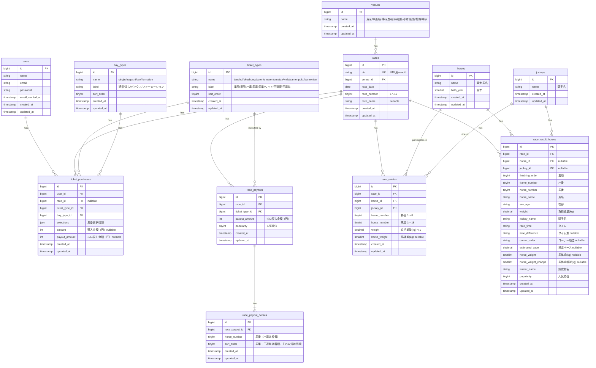

# ER図

## selectionsカラムのJSONフォーマット

| 買い方 | フォーマット | 例 |
|---|---|---|
| single / box（①複数頭選択） | `{"horses": [馬番...]}` | `{"horses": [1, 3, 5]}` |
| nagashi（②軸1頭+相手複数） | `{"axis": [馬番], "others": [馬番...]}` | `{"axis": [3], "others": [1, 5, 7]}` |
| nagashi（③軸2頭+相手複数） | `{"axis": [馬番, 馬番], "others": [馬番...]}` | `{"axis": [3, 5], "others": [1, 7]}` |
| formation（④着順別複数頭選択） | `{"columns": [[1着...], [2着...], [3着...]]}` | `{"columns": [[1,2],[3,4],[5,6,7]]}` |
