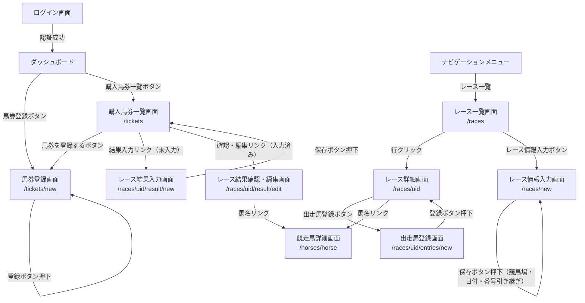

# 画面遷移図

```mermaid
flowchart TD
    Login[ログイン画面] -->|認証成功| Dashboard[ダッシュボード]
    Dashboard -->|馬券登録ボタン| TicketsNew[馬券登録画面\n/tickets/new]
    TicketsNew -->|登録ボタン押下| TicketsNew
    Dashboard -->|購入馬券一覧ボタン| TicketsIndex[購入馬券一覧画面\n/tickets]
    TicketsIndex -->|馬券を登録するボタン| TicketsNew
    TicketsIndex -->|結果入力リンク（未入力）| RaceResultNew[レース結果入力画面\n/races/uid/result/new]
    TicketsIndex -->|確認・編集リンク（入力済み）| RaceResultEdit[レース結果確認・編集画面\n/races/uid/result/edit]
    RaceResultNew -->|保存ボタン押下| TicketsIndex
    Nav[ナビゲーションメニュー] -->|レース一覧| RacesIndex[レース一覧画面\n/races]
    RacesIndex -->|行クリック| RaceDetail[レース詳細画面\n/races/uid]
    RacesIndex -->|レース情報入力ボタン| RacesNew[レース情報入力画面\n/races/new]
    RacesNew -->|保存ボタン押下（競馬場・日付・番号引き継ぎ）| RacesNew
    RaceDetail -->|出走馬登録ボタン| RaceEntriesNew[出走馬登録画面\n/races/uid/entries/new]
    RaceEntriesNew -->|登録ボタン押下| RaceDetail
    RaceDetail -->|馬名リンク| HorseDetail[競走馬詳細画面\n/horses/horse]
    RaceResultEdit -->|馬名リンク| HorseDetail
```
